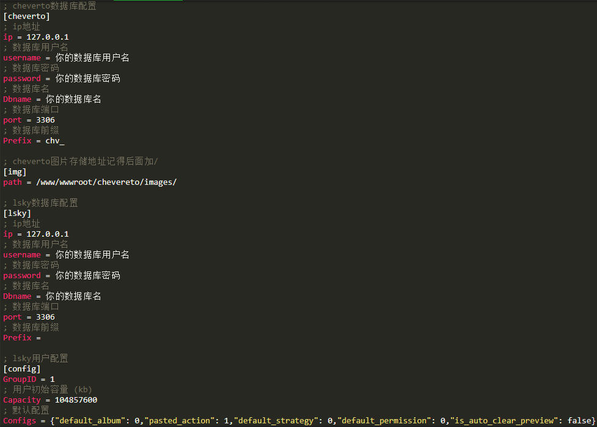
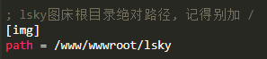
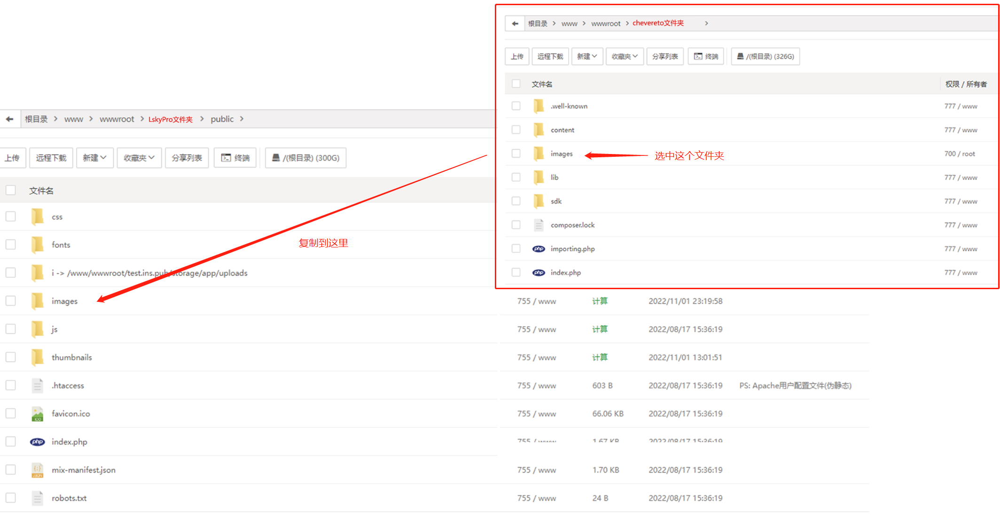
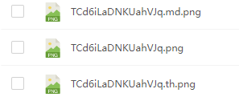
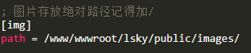
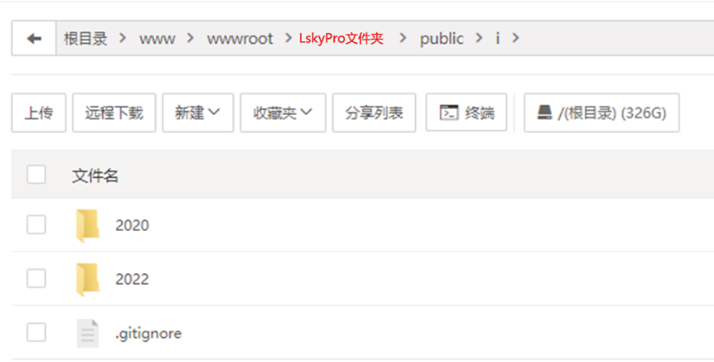

## chevereto图床数据库转LskyPro 2.0

## 前期准备

下载Release中编译好的文件

或者自行在服务器上使用 [这个脚本](script/build.sh) 或者手动使用 `go build` 编译

上传到服务器任意文件夹

然后用 `chmod +x chevereto2LskyPro` 让文件具有执行权限

---
## 迁移数据库

先到`configs/app.ini` 中配置数据库

然后用 `./chevereto2LskyPro` 启动程序

根据提示选择操作, 我们先选择 `转换数据库`

如果尚未进行过转换, 推荐从 `1转移用户&相册开始` 开始

下面我们需要手动迁移一下网站的图片文件

**至此, 所有的数据迁移工作已经完成**

---
## 删除重复文件 (可选)

默认图床一个图片会默认分成三种, 这里我们用不到

我们这里注意配置一下路径

这个是我们LskyPro图床的图片存储绝对路径

然后我们直接启动应用, 选择 `删除重复文件` 即可